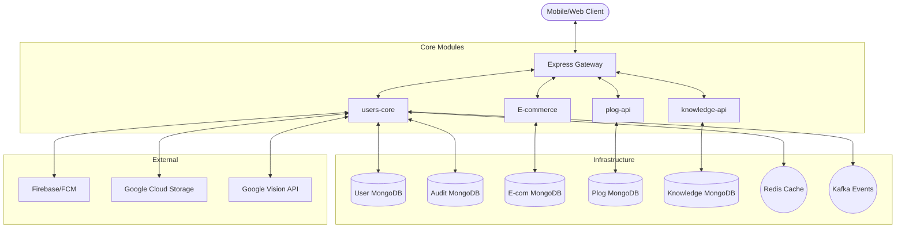

# 🌐 Users Payment System — Comprehensive Documentation

> **Version:** 2.0.0  
> **Last Updated:** March 2026  
> **Purpose:** Detailed technical manual for all sub-modules to support front-end development.

---

## 🏗️ System Architecture

The project is built on a distributed micro-architecture using Node.js and Express, with multiple MongoDB databases for isolation. Communication is handled via REST APIs and an event-driven mechanism using Kafka and Redis.



---

## 🔐 1. Authentication & Security

### Security Stack
- **Helmet**: HTTP security headers.
- **CORS**: White-listed origins.
- **XSS-Clean**: Protection against Cross-Site Scripting.
- **Express Rate Limit**: Prevents brute force (5 requests/15m for auth).
- **JWT + AES-256**: Tokens are signed (JWT) then encrypted (AES-256-CBC) before being sent to the client.

### Token Strategy
| Token Type | TTL | Storage | Usage |
| :--- | :--- | :--- | :--- |
| **Access Token** | 7 Days | `auth-token` header | API Request Authorization |
| **Refresh Token** | 365 Days | `refresh-token` header | Renewing Access Token |

---

## 👤 2. Users Core Module (`users-core`)

The central component for identity, financial tracking, and verification.

### 2.1 Core Sub-Components
- **Identity (User)**: Basic info, role-based access (doctor, nursing, patient, etc.).
- **Wallet**: Real-time balance, commission tracking, and virtual credits.
- **KYC (Identity Verification)**: Automated ID verification using Google Vision OCR and Face Matching.
- **Profile**: Academic degrees, professional descriptions, and avatars.

### 2.2 Key Data Models

#### `UserSchema`
| Field | Type | Description |
| :--- | :--- | :--- |
| `role` | `String` | `doctor`, `nursing`, `patient`, `pharmacy`, `shipping_company`, `admin` |
| `username` | `String` | Display name |
| `email.address` | `String` | Verified email address |
| `phone` | `String` | Unique phone number |
| `location` | `GeoPoint` | `[longitude, latitude]` for proximity search |
| `fcmTokens` | `[String]` | Up to 5 FCM tokens for notifications |
| `academicDegrees` | `[Object]` | Education history for professional users |

#### `UserWalletSchema`
| Field | Type | Description |
| :--- | :--- | :--- |
| `RemainingAccount` | `Number` | Current spendable balance |
| `commissionDebt` | `Number` | Owed fees to the platform |
| `balance` | `Number` | Total earnings history |
| `credits` | `Number` | Virtual platform credits |

---

## 🛒 3. E-commerce Module (`E-commerce`)

Facilitates B2B connections between pharmacies and shipping companies.

### 3.1 Business Logic
1.  **Invitations**: A pharmacy sends an invitation to a shipping company to form a contract.
2.  **Contracts**: Once accepted, a contract is established, allowing for business transactions.
3.  **Chat**: Dedicated chat channels for contract-related coordination.

### 3.2 Key Data Models

#### `ContractSchema`
| Field | Type | Description |
| :--- | :--- | :--- |
| `pharmacy` | `ObjectId` | Reference to User (pharmacy role) |
| `shippingCompany` | `ObjectId` | Reference to User (shipping role) |
| `status` | `String` | `pending`, `accepted`, `rejected`, `inactive` |
| `businessDetails` | `Object` | Form details: Address, Hours, Phone |

---

## 📝 4. Plog API (`plog-api`)

A content management system for health-related blogging and community engagement.

### 4.1 Features
- **Posts**: Rich content with images and categories.
- **Comments**: Nested interactions on posts.
- **Likes**: User engagement tracking.

### 4.2 Key Data Models

#### `PostSchema`
| Field | Type | Description |
| :--- | :--- | :--- |
| `title` | `String` | Post headline |
| `description` | `String` | MarkDown or HTML content |
| `category` | `String` | e.g., "Health", "Medicine", "Tips" |
| `likes` | `[ObjectId]` | Array of users who liked the post |

---

## 📖 5. Knowledge API (`knowledge-api`)

A specialized search engine for medical information.

### 5.1 Features
- **Search**: Fuzzy text search across medical articles.
- **Versioning**: Articles can have sources (Wikipedia, OpenFDA, local).
- **Categories**: `disease`, `drug`, `treatment`, `symptom`.

### 5.2 Key Data Models

#### `KnowledgeArticleSchema`
| Field | Type | Description |
| :--- | :--- | :--- |
| `title` | `String` | Article name |
| `content` | `String` | Detailed medical data |
| `tags` | `[String]` | Indexable keywords |

---

## 🚀 6. API Reference (Core Endpoints)

### 6.1 Authentication (`/users`)
- `POST /register`: Create new user.
- `POST /login`: Authenticate and receive encrypted tokens.
- `POST /verifyEmail`: Confirm email with 6-digit code.
- `PATCH /updateLocation`: Update user coordinate for proximity features.

### 6.2 E-commerce Contracts (`/api/contracts`)
- `POST /invite`: Send business invitation.
- `PUT /respond/:id`: Accept/Reject invitation.
- `GET /my-contracts`: List all active business relations.

### 6.3 Blogging (`/api/posts`)
- `GET /`: Fetch all posts (paginated).
- `POST /:id`: Create post for a specific user.
- `PUT /:id/like`: Toggle like status.

---

## 🔔 7. Notifications (`Notification`)

Built using **Firebase Cloud Messaging (FCM)**. 
- **Automatic Triggers**: Notifications are sent on order updates, new messages, and contract changes.
- **Cleanup**: Recurring worker (Mon 3:00 AM) removes stale/invalid FCM tokens from user records.

---

## 🛠️ 8. Developer Notes
1.  **Proximity Search**: Use MongoDB `$near` operator on the `location` field.
2.  **Image Uploads**: All images should be uploaded via the `gcs/sign-upload` endpoint to get a signed URL before uploading to Google Cloud Storage.
3.  **Error Handling**: Standardized error responses follow this format:
    ```json
    {
      "status": "error",
      "message": "Human readable message",
      "code": "ERROR_CODE",
      "details": { ... }
    }
    ```
